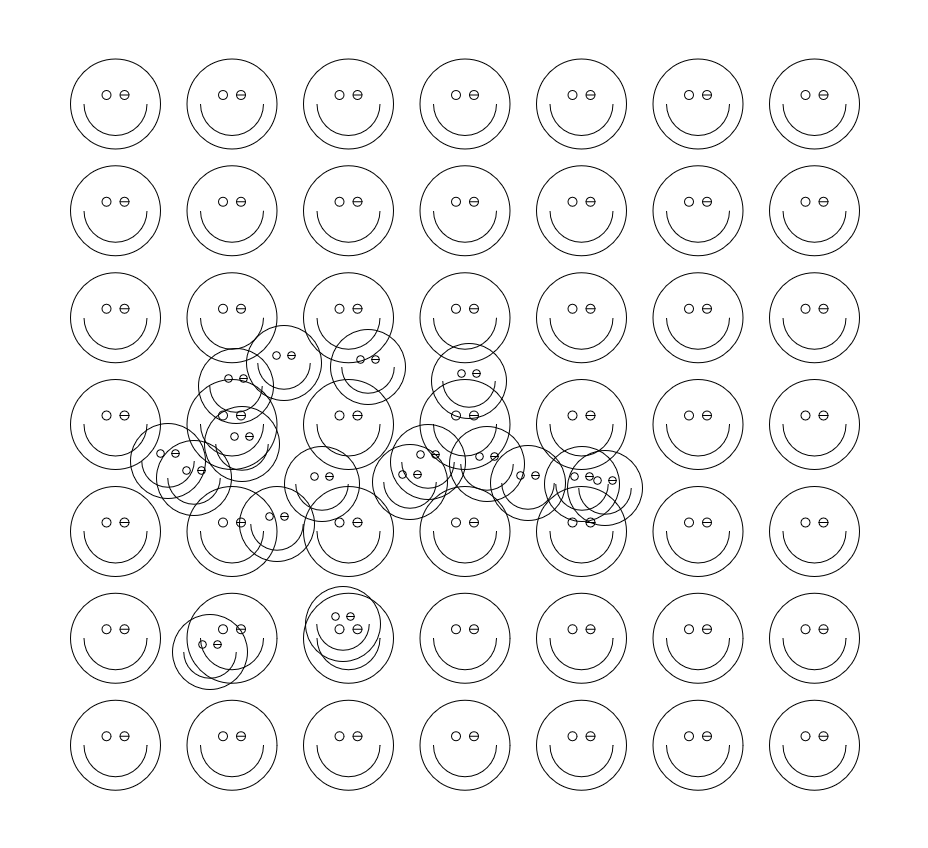

# trying-wasm-rust

Educational Rust + WebAssembly playground.

I started this repo to experiment with Rust-in-the-browser and `wasm-bindgen`.
Initial commit date: `2022-12-23`.

## What it does
- Boots from Rust (`#[wasm_bindgen(start)]`)
- Draws a responsive smiley-face grid on a full-screen canvas
- Re-renders on browser resize
- Lets you add extra smileys by clicking the canvas

## Setup
- Requires: `rustup`, `wasm-pack`, and Node.js/npm
- Use repo Node version: `nvm use` (installs from `.nvmrc` with `nvm install`)
- Install wasm target: `rustup target add wasm32-unknown-unknown`
- Install JS deps: `npm install`

## Run (Dev)
- Start dev server: `npm run serve`
- Open: `http://localhost:8080`

## Build (Prod)
- Build: `npm run build`
- Output: `dist/`

## Run (Prod Build Locally)
- Serve `dist/` with any static server, for example:
  - `python3 -m http.server 4173 --directory dist`
  - Then open `http://localhost:4173`
